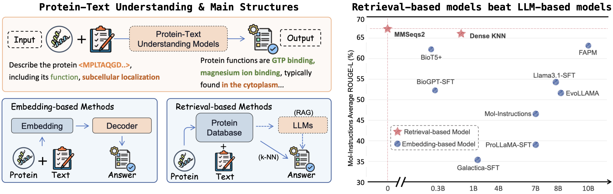
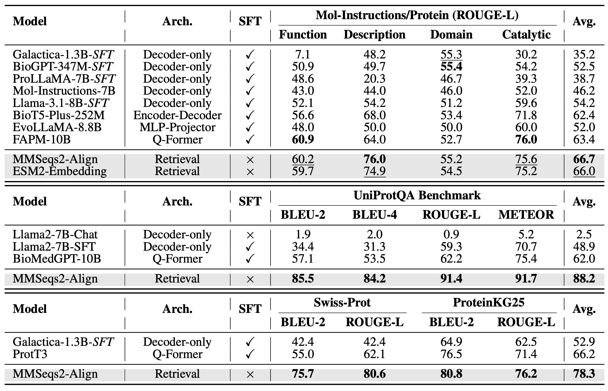
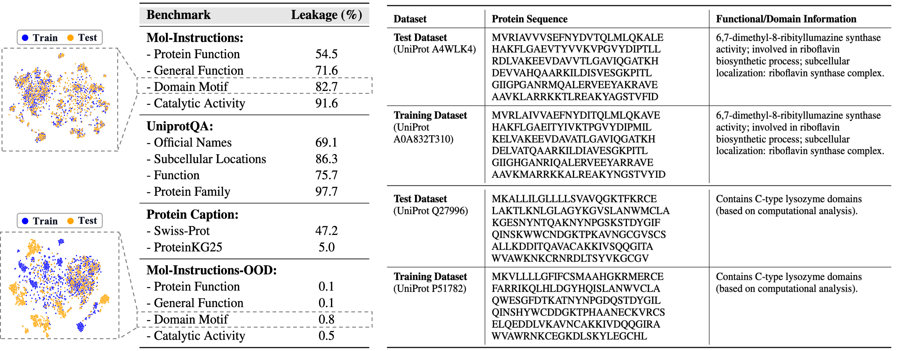

<h2 align="center">
  
  <a href=""> RAPM (Retrieval-Augmented Protein Modeling) </a>
</h2>

**Official implementation of the paper "Rethinking Text-based Protein Understanding: Retrieval or LLM?"**

[](https://github.com/tatsu-lab/stanford_alpaca/blob/main/LICENSE)
[](https://github.com/tatsu-lab/stanford_alpaca/blob/main/DATA_LICENSE)
[](http://arxiv.org/abs/2505.20354)
[](https://github.com/IDEA-XL/RAPM)
[](https://huggingface.co/datasets/TimeRune/Mol-Inst-OOD)

### [📖] Abstract:
---
In recent years, protein-text models have gained significant attention for their potential in protein generation and understanding. Current approaches focus on integrating protein-related knowledge into large language models through continued pretraining and multi-modal alignment, enabling simultaneous comprehension of textual descriptions and protein sequences. 
Through a thorough analysis of existing model architectures and text-based protein understanding benchmarks, **we identify significant data leakage issues present in current benchmarks.** Moreover, **conventional metrics derived from natural language processing fail to accurately assess the model's performance in this domain.** To address these limitations, we reorganize existing datasets and introduce a novel evaluation framework based on biological entities. Motivated by our observation, we propose a **retrieval-enhanced method**, which significantly outperforms fine-tuned LLMs for protein-to-text generation and shows accuracy and efficiency in training-free scenarios.



### [‼️] Data Leakage in Existing Protein-to-Text Benchmark 
---
We evaluated four widely used benchmarks for text-based protein understanding: the protein comprehension tasks from Mol-Instructions [1], UniProtQA [2], the Swiss-Prot Protein Caption dataset [3], and the ProteinKG25 dataset [4].

<details>
  <summary style="cursor: pointer; font-style: italic; font-size: smaller;">Show references</summary>
  <p style="font-style: italic; font-size: smaller;">
    [1] Mol-Instructions: A Large-Scale Biomolecular Instruction Dataset for Large Language Models <br>
    [2] BioMedGPT: Open Multimodal Generative Pre-trained Transformer for BioMedicine <br>
    [3] ProtT3: Protein-to-Text Generation for Text-based Protein Understanding <br>
    [4] OntoProtein: Protein Pretraining With Ontology Embedding <br>
  </p>
</details>

For sequence retrieval, we used MMSeqs2 with the following command:

```sh
mmseqs easy-search --max-accept 1 -e 1e5 -v 0 test_seqs.fasta train_seqs.fasta result.m8 tmp  
```
For each protein sequence in the test set, the label of its most similar counterpart in the training set was assigned as the predicted output. Note that we process different subtasks separately, instead of retrieving from mixed candidates.

The results, shown in the table below, demonstrate that all current LLM-based models perform worse than retrieval-based models.




We also analyzed data leakage rates, defined as the probability of obtaining identical labels using the retrieval method. For Mol-Instructions, we only consider metadata matches, ignoring differences in response phrasing, as shown in the table below. The results indicate that data leakage is prevalent in almost all benchmarks, with UniProtQA-Protein Family being the most severe case, where 97.7% of the test set can be predicted by retrieval.


（Left: Leakage Rate of different datasets; Right: An example sample of data leakage.）


<!-- 基于以上内容，我们提出了 Out-of-Distribution 划分，该划分基于序列相似度，并且剔除掉了训练集中与测试集相似度较高的样本。 -->

Based on the above findings, we propose an Out-of-Distribution (OOD) split that is based on sequence similarity and removes samples in the training set that are highly similar to those in the test set. This split is designed to mitigate data leakage issues and provide a more accurate evaluation of model performance.

OOD datasets can be downloaded from [Huggingface-link](https://huggingface.co/datasets/TimeRune/Mol-Inst-OOD).


### Citation
If you find our work useful for your research and applications, please cite using this BibTeX:
```bibtex
@misc{wu2025rethinkingtextbasedproteinunderstanding,
      title={Rethinking Text-based Protein Understanding: Retrieval or LLM?}, 
      author={Juntong Wu and Zijing Liu and He Cao and Hao Li and Bin Feng and Zishan Shu and Ke Yu and Li Yuan and Yu Li},
      year={2025},
      eprint={2505.20354},
      archivePrefix={arXiv},
      primaryClass={cs.CL},
      url={https://arxiv.org/abs/2505.20354}, 
}
```


