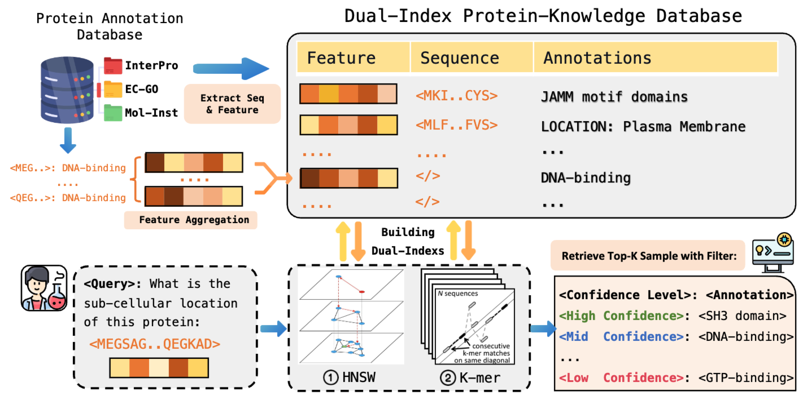
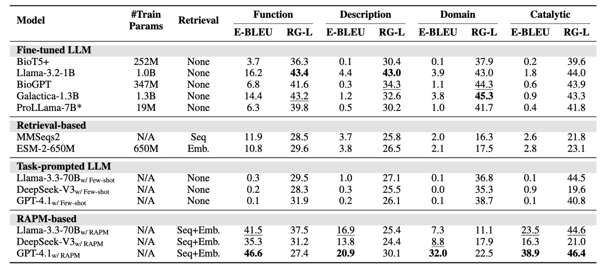

<h2 align="center">
  
  <a href=""> RAPM (Retrieval-Augmented Protein Modeling) </a>
</h2>

<h4 align="center">

**Official implementation of the paper "Rethinking Text-based Protein Understanding: Retrieval or LLM?"**

</h4>

<h5 align="center">

[](https://github.com/tatsu-lab/stanford_alpaca/blob/main/LICENSE)
[](https://github.com/tatsu-lab/stanford_alpaca/blob/main/DATA_LICENSE)
[](http://arxiv.org/abs/2505.20354)
[](https://github.com/IDEA-XL/RAPM)
[](https://huggingface.co/datasets/TimeRune/Mol-Inst-OOD)

</h5>

### 📖 Abstract:
---
In recent years, protein-text language models are widely used to solve protein understanding tasks. Current approaches focus on *integrating protein-related knowledge into LLMs through continued pretraining or multi-modal alignment*, enabling LLMs to jointly understand protein sequences and textual descriptions.

However, by analysing existing model architectures and text-based protein understanding benchmarks, our analysis reveals *significant data leakage* in current text-based protein benchmarks, and *metrics like ROUGE, BLEU are inadequate for evaluation in this domain.* 

To address these limitations, we reorganize existing datasets and introduce a novel OOD dataset, [Prot-Inst-OOD](https://huggingface.co/datasets/TimeRune/Prot-Inst-OOD), along with a new evaluation metric, [Entity-BLEU](#Entity-BLEU). Furthermore, we propose a **retrieval-enhanced method** that significantly outperforms fine-tuned LLMs in protein-to-text generation, demonstrating both high accuracy and efficiency in training-free scenarios.


### ‼️ Data Leakage in Existing Protein-to-Text Benchmark 
---
We evaluated four widely used benchmarks for text-based protein understanding: the protein comprehension tasks from Mol-Instructions [1], UniProtQA [2], Swiss-Prot Protein Caption [3], and ProteinKG25 [4].

<details>
  <summary style="cursor: pointer; font-style: italic; font-size: smaller;">Show references</summary>
  <p style="font-style: italic">
    [1] Mol-Instructions: A Large-Scale Biomolecular Instruction Dataset for Large Language Models <br>
    [2] BioMedGPT: Open Multimodal Generative Pre-trained Transformer for BioMedicine <br>
    [3] ProtT3: Protein-to-Text Generation for Text-based Protein Understanding <br>
    [4] OntoProtein: Protein Pretraining With Ontology Embedding <br>
  </p>
</details>

For sequence retrieval, we used MMSeqs2 with the following command:

```sh
mmseqs easy-search --max-accept 1 -e 1e5 -v 0 test_seqs.fasta train_seqs.fasta result.m8 tmp  
```
For each protein sequence in the test set, the label of its most similar counterpart in the training set was assigned as the predicted output. Note that we process different subtasks separately, instead of retrieving from mixed candidates.

The results, shown in the table below, demonstrate that all current LLM-based models perform worse than retrieval-based models.


We also analyzed data leakage rates, defined as the probability of obtaining identical labels using the retrieval method. For Mol-Instructions, we only consider metadata matches, ignoring differences in response phrasing, as shown in the table below. The results indicate that data leakage is prevalent in almost all benchmarks, with UniProtQA-Protein Family being the most severe case, where 97.7% of the test set can be predicted by retrieval.


（Left: Leakage Rate of different datasets; Right: An example sample of data leakage.）


<!-- 基于以上内容，我们提出了 Out-of-Distribution 划分，该划分基于序列相似度，并且剔除掉了训练集中与测试集相似度较高的样本。 -->

Based on the above findings, we propose an Out-of-Distribution (OOD) split that is based on sequence similarity and removes samples in the training set that are highly similar to those in the test set. This split is designed to mitigate data leakage issues and provide a more accurate evaluation of model performance.

OOD datasets can be downloaded from [Huggingface-link](https://huggingface.co/datasets/TimeRune/Prot-Inst-OOD).


### 📊 New Metrics
---

#### Problems in Existing Metrics


Here is an example of the evaluation results using ROUGE-L and BLEU metrics on a sample protein sequence:

<details>
  <summary style="cursor: pointer; font-style: italic; font-size: smaller;">Show Example</summary>

<table>
  <tr>
    <td><b>Ground Truth:</b></td>
    <td>
      <code>Upon evaluating your submitted sequence, our predictive algorithms suggest the presence of: <u>ABC transporter domains</u></code>
    </td>
  </tr>
  <tr>
    <td><b>Prediction 1<br>(True Answer):</b></td>
    <td>
      <code><em>The sequence you provided has been analyzed for potential protein domains or motifs. The results are:</em> <b>ABC transporter domains</b></code>
      <br>
      <span style="background-color:#f5f5f5; padding:2px 6px; border-radius:3px; font-size:90%; color:#333;">ROUGE-L = 0.27; BLEU = 0.04</span>
    </td>
  </tr>
  <tr>
    <td><b>Prediction 2<br>(False Answer):</b></td>
    <td>
      <code><b>Upon evaluating your submitted sequence, our predictive algorithms suggest the presence of: </b><em>GGDEF, MHYT, EAL domains</em></code>
      <br>
      <span style="background-color:#f5f5f5; padding:2px 6px; border-radius:3px; font-size:90%; color:#333;">ROUGE-L = 0.83; BLEU = 0.73</span>
    </td>
  </tr>
</table>

<p align="center" style="font-size:90%;">
  <span><b>Bold</b></span>: Matched Part &nbsp;&nbsp;
  <span><b>Italic</b></span>: Mismatched Part
</p>


It is evident that the first prediction, which is the true answer, has a low ROUGE-L and BLEU score due to the lack of exact matches in the generated text. In contrast, the second prediction, which is incorrect, achieves high scores despite containing incorrect information. This highlights the inadequacy of these metrics for evaluating protein-to-text generation tasks.

</details>

#### Entity-BLEU

**Entity-BLEU** is a metric specifically designed for biological question answering, where standard NLP metrics like ROUGE and BLEU often fail to reflect the true quality of predictions. Unlike traditional metrics that treat all tokens equally, Entity-BLEU focuses on the correct identification of biological entities, such as protein domains or enzyme names, regardless of their order in the text.

The calculation process is as follows:
1. **Entity Extraction:** Biological entities are extracted from both the predicted and reference answers using a curated knowledge base
2. **BLEU Calculation:** The standard BLEU score is then computed, but instead of using the raw text, it operates on the sequences of extracted entities. This makes the metric order-invariant and robust to variations in phrasing.

```math
\text{Entity-BLEU} = \text{BP} \times \exp\left( \sum_{n=1}^{N} w_n \log p_n \right )
```

where BP is the brevity penalty, $w_n$ are the weights for the n-gram precision scores $p_n$, and all calculations are performed on the extracted entity sequences.

Entity-BLEU focuses on the correct identification of biological entities, providing a more accurate evaluation for protein-to-text generation tasks.


In the Prot-Inst-OOD dataset, we provide the Bio-Entity list for all answers in the "metadata". This enables direct and reliable evaluation using Entity-BLEU, as entity extraction is already performed and available for each sample.


### 🚀 Retrieval-Augmented Protein Modeling (RAPM)
---

#### Model Overview and Results
<details>
  <summary style="cursor: pointer; font-style: italic; font-size: smaller;">Show Model Overview and Results</summary>

RAPM is a retrieval-augmented method that enhances protein understanding by integrating retrieval mechanisms with language models. It retrieves relevant protein sequences from a database and uses them to inform the generation of text-based answers.



We evaluate RAPM on the Prot-Inst-OOD dataset, comparing it with various LLM-based models, including fine-tuned LLMs and retrieval-based methods. The results demonstrate that RAPM achieves superior performance in terms of both accuracy and efficiency.




</details>

#### Implementation

1. Prepare environment:

- python=3.12.7
- torch=2.7.0+cu118
- transformers=4.45.0
- cuda=11.7
- mmseqs2 (for sequence retrieval)

You can use the following commands to set up the environment:

```bash
conda create -n RAPM python=3.12.7
conda activate RAPM
pip install -r requirements.txt
```

MMseqs2 can be installed from [official repository](https://github.com/soedinglab/MMseqs2).

2. Download the Prot-Inst-OOD dataset from [Huggingface](https://huggingface.co/datasets/TimeRune/Prot-Inst-OOD).

Put the dataset in the `dataset` folder, or construct your own dataset in the same format. An example dataset structure can be seen in the `dataset/example_task.json`.

3. Run simple retrieval method (MMSeqs2 & ESM2 embedding retrieval):

```bash
python retrival_methods/simple_retrieval.py
```

4. Run RAPM:

Build bio-knowledge database and run RAPM with the following command:

```bash
python RAPM/RAG_prompt_cons.py RAPM/dataset 10 
```

Inference RAG_prompts with LLMs:

```bash
python RAPM/LLM_inference.py <task_name> <k>
```


### Citation
If you find our work useful for your research and applications, please cite using this BibTeX:
```bibtex
@misc{wu2025rethinkingtextbasedproteinunderstanding,
      title={Rethinking Text-based Protein Understanding: Retrieval or LLM?}, 
      author={Juntong Wu and Zijing Liu and He Cao and Hao Li and Bin Feng and Zishan Shu and Ke Yu and Li Yuan and Yu Li},
      year={2025},
      eprint={2505.20354},
      archivePrefix={arXiv},
      primaryClass={cs.CL},
      url={https://arxiv.org/abs/2505.20354}, 
}
```


